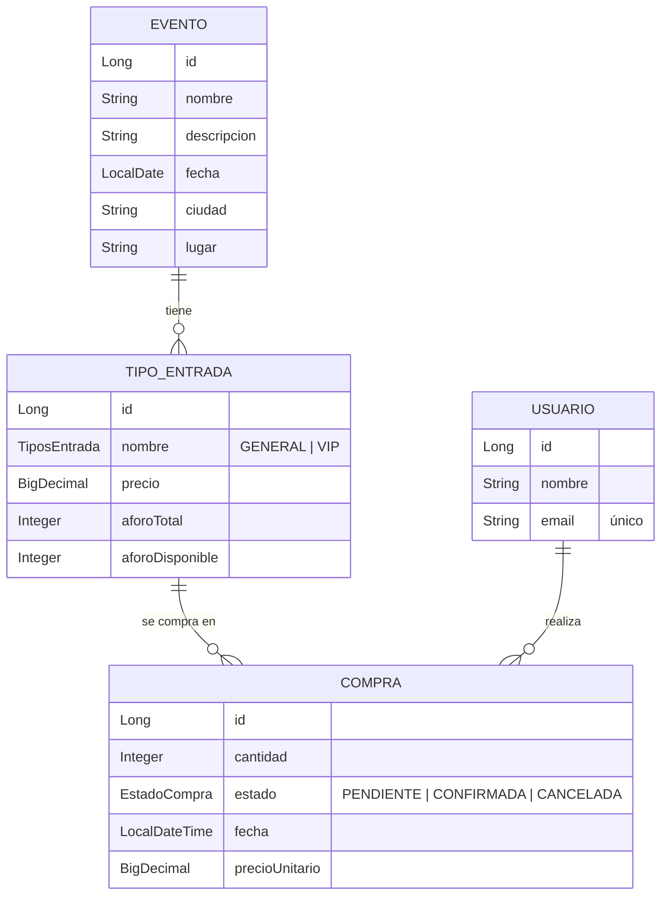

# Event Ticketing Platform (eventos)

> **En desarrollo.** Esta documentación es temporal. La API, el modelo de datos y la configuración pueden cambiar sin previo aviso.

API REST para gestionar eventos, sus tipos de entrada (GENERAL / VIP) con control de aforo, usuarios y compras de entradas.

## Stack

| Área            | Tecnología                                   |
|-----------------|----------------------------------------------|
| Lenguaje        | Java 25                                      |
| Framework       | Spring Boot 4.1.1 (Web MVC, Data JPA, Security, Validation, Actuator) |
| Build           | Gradle (wrapper incluido)                    |
| Documentación API | springdoc-openapi 3.1.0 (Swagger UI)       |
| Base de datos   | H2 en memoria (local) · PostgreSQL 17 (Docker) |
| Mensajería      | Apache Kafka 4.0.1 (Docker)                  |
| Otros           | Lombok                                       |

## Estado actual

| Funcionalidad | Estado | Notas |
|---|---|---|
| CRUD de eventos con tipos de entrada | ✅ | Filtros opcionales por `ciudad` (sin distinguir mayúsculas) y `fecha` |
| Reglas de negocio al editar eventos | ✅ | No se puede reducir el aforo por debajo de lo vendido, ni eliminar un tipo con ventas, ni repetir tipos |
| Usuarios y compras | 🚧 | Entidades, DTOs y repositorios listos; aún sin endpoints |
| Kafka | 🚧 | Dependencia y broker configurados; aún sin productores/consumidores |
| Seguridad | 🚧 | HTTP Basic. `/eventos/**`, Swagger y `/actuator/health`/`info` son públicos |

## Arranque rápido

### Local (H2 en memoria)

```bash
./gradlew bootRun        # Linux / macOS
gradlew.bat bootRun      # Windows
```

La aplicación arranca en `http://localhost:8080`. Por defecto Kafka apunta a `localhost:9092` (configurable con `SPRING_KAFKA_BOOTSTRAP_SERVERS`).

### Docker (app + PostgreSQL + Kafka)

```bash
cp .env.example .env
docker compose up --build
```

Variables disponibles en `.env`:

| Variable | Por defecto | Descripción |
|---|---|---|
| `APP_PORT` | `8080` | Puerto expuesto de la aplicación |
| `POSTGRES_PORT` | `5432` | Puerto expuesto de PostgreSQL |
| `POSTGRES_DB` | `eventos` | Nombre de la base de datos |
| `POSTGRES_USER` | `eventos` | Usuario de PostgreSQL |
| `POSTGRES_PASSWORD` | `eventos` | Contraseña de PostgreSQL |
| `SPRING_JPA_HIBERNATE_DDL_AUTO` | `update` | Estrategia de esquema de Hibernate |
| `KAFKA_PORT` | `29092` | Puerto externo de Kafka |

## API

- Swagger UI: http://localhost:8080/swagger-ui.html
- OpenAPI: http://localhost:8080/v3/api-docs
- Health: http://localhost:8080/actuator/health

### Eventos

| Método | Ruta | Descripción | Respuesta |
|---|---|---|---|
| `GET` | `/eventos` | Lista eventos. Filtros opcionales: `ciudad`, `fecha` (`YYYY-MM-DD`) | `200` |
| `GET` | `/eventos/{id}` | Obtiene un evento con sus tipos de entrada | `200` / `404` |
| `POST` | `/eventos` | Crea un evento | `201` / `400` |
| `PUT` | `/eventos/{id}` | Reemplaza los datos de un evento | `200` / `400` / `404` / `409` |
| `DELETE` | `/eventos/{id}` | Elimina un evento | `204` / `404` |

Ejemplo de petición (`POST /eventos`):

```json
{
  "nombre": "Concierto de verano",
  "descripcion": "Festival al aire libre",
  "fecha": "2026-12-01",
  "ciudad": "Madrid",
  "lugar": "Estadio Central",
  "tipoEntrada": [
    { "nombre": "GENERAL", "precio": 35.00, "aforoTotal": 500 },
    { "nombre": "VIP", "precio": 90.00, "aforoTotal": 50 }
  ]
}
```

Ejemplo de filtro:

```
GET /eventos?ciudad=Madrid&fecha=2026-12-01
```

### Errores

| Código | Cuándo |
|---|---|
| `400` | Validación fallida o tipo de entrada repetido |
| `404` | Evento, usuario o tipo de entrada no encontrado |
| `409` | Aforo insuficiente o edición que entra en conflicto con entradas ya vendidas |

## Modelo de dominio



## Estructura del proyecto

```
src/main/java/com/jnrptt/eventos/
├── config/       # Configuración de seguridad
├── controller/   # Controladores REST
├── dto/          # Objetos de petición y respuesta
├── exception/    # Excepciones propias y manejador global
├── model/        # Entidades JPA y enums
├── repository/   # Repositorios Spring Data y Specifications
└── service/      # Lógica de negocio
```

## Tests

```bash
./gradlew test
```

Tests de integración con `@SpringBootTest` sobre H2 en memoria.

## Próximos pasos (tentativo)

- [ ] Endpoints de usuarios
- [ ] Endpoints de compras con control de aforo
- [ ] Publicación de eventos de compra en Kafka
- [ ] Autenticación y autorización reales
