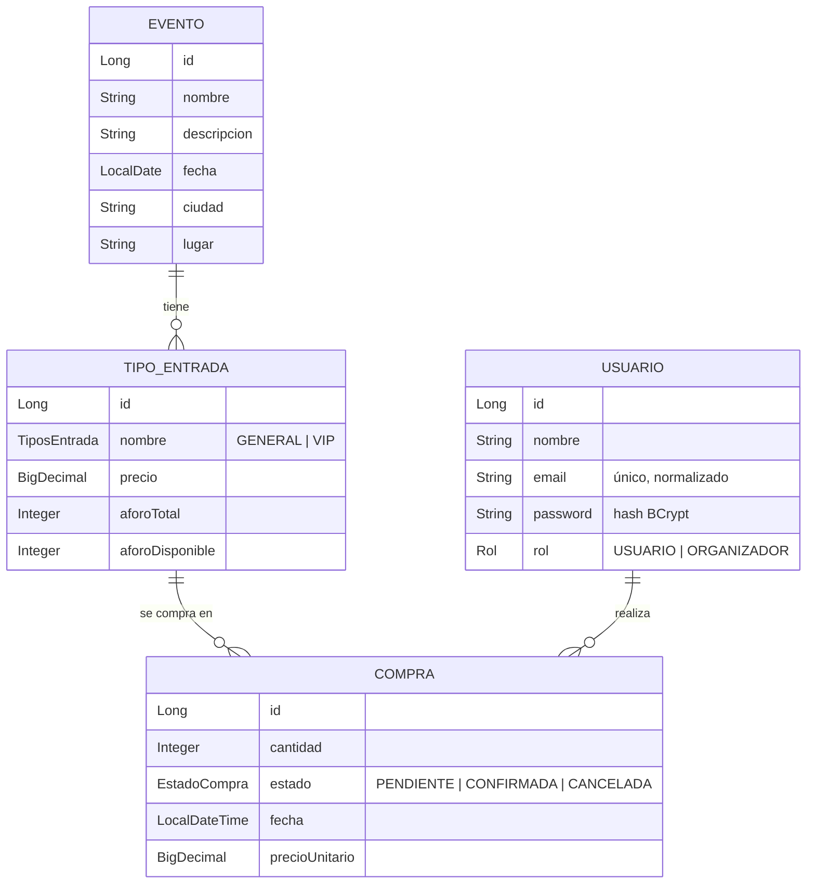

# Event Ticketing Platform (eventos)

> **En desarrollo.** Esta documentación es temporal. La API, el modelo de datos y la configuración pueden cambiar sin previo aviso.

API REST para gestionar eventos, sus tipos de entrada (GENERAL / VIP) con control de aforo, usuarios y compras de entradas.

## Stack

| Área            | Tecnología                                   |
|-----------------|----------------------------------------------|
| Lenguaje        | Java 25                                      |
| Framework       | Spring Boot 4.1.1 (Web MVC, Data JPA, Security, Validation, Actuator) |
| Build           | Gradle (wrapper incluido)                    |
| Documentación API | springdoc-openapi 3.1.0 (Swagger UI)       |
| Base de datos   | H2 en memoria (local) · PostgreSQL 17 (Docker) |
| Mensajería      | Apache Kafka 4.0.1 (Docker)                  |
| Otros           | Lombok                                       |

## Estado actual

| Funcionalidad | Estado | Notas |
|---|---|---|
| CRUD de eventos con tipos de entrada | ✅ | Filtros opcionales por `ciudad` (sin distinguir mayúsculas) y `fecha` |
| Reglas de negocio al editar eventos | ✅ | No se puede reducir el aforo por debajo de lo vendido, ni eliminar un tipo con ventas, ni repetir tipos |
| Compra de entradas | ✅ | `POST /compras` con control de aforo y bloqueo pesimista frente a compras concurrentes |
| Usuarios | ✅ | Registro y login; organizador inicial creado al arrancar desde variables de entorno |
| Seguridad | ✅ | JWT (HS256) con roles `USUARIO` / `ORGANIZADOR`; el comprador sale del token |
| Estados de compra | 🚧 | Las compras se crean `CONFIRMADA`; `PENDIENTE` (pago) y `CANCELADA` (devolución de aforo) pendientes |
| Kafka | 🚧 | Dependencia y broker configurados; aún sin productores/consumidores |

## Arranque rápido

### Local (H2 en memoria)

```bash
./gradlew bootRun        # Linux / macOS
gradlew.bat bootRun      # Windows
```

La aplicación arranca en `http://localhost:8080`. Por defecto Kafka apunta a `localhost:9092` (configurable con `SPRING_KAFKA_BOOTSTRAP_SERVERS`).

En local se usa un `JWT_SECRET` de desarrollo incluido en `application.properties`. Para poder crear eventos hace falta un organizador; defínelo antes de arrancar (ver [Organizador inicial](#organizador-inicial)):

```bash
ORGANIZADOR_EMAIL=org@example.com ORGANIZADOR_PASSWORD=cambia-esto ./gradlew bootRun
```

### Docker (app + PostgreSQL + Kafka)

```bash
cp .env.example .env
# Edita .env: JWT_SECRET es obligatorio (genera uno con: openssl rand -base64 32)
docker compose up --build
```

Sin `JWT_SECRET`, `docker compose` se niega a arrancar. Si tienes un volumen de PostgreSQL de una versión anterior (sin las columnas `password` y `rol` de usuarios), recréalo con `docker compose down -v`; se pierden los datos de desarrollo.

Variables disponibles en `.env`:

| Variable | Por defecto | Descripción |
|---|---|---|
| `APP_PORT` | `8080` | Puerto expuesto de la aplicación |
| `POSTGRES_PORT` | `5432` | Puerto expuesto de PostgreSQL |
| `POSTGRES_DB` | `eventos` | Nombre de la base de datos |
| `POSTGRES_USER` | `eventos` | Usuario de PostgreSQL |
| `POSTGRES_PASSWORD` | `eventos` | Contraseña de PostgreSQL |
| `SPRING_JPA_HIBERNATE_DDL_AUTO` | `update` | Estrategia de esquema de Hibernate |
| `KAFKA_PORT` | `29092` | Puerto externo de Kafka |
| `JWT_SECRET` | — (obligatoria) | Clave para firmar los tokens, en Base64 y de al menos 32 bytes |
| `ORGANIZADOR_EMAIL` | vacía | Email del organizador inicial (opcional) |
| `ORGANIZADOR_PASSWORD` | vacía | Password del organizador inicial (opcional) |
| `ORGANIZADOR_NOMBRE` | `Organizador` | Nombre del organizador inicial |

## Autenticación

La API usa JWT. El flujo es:

1. **Registro** (`POST /auth/registro`): crea un usuario con rol `USUARIO`.
2. **Login** (`POST /auth/login`): devuelve un token firmado que caduca en 1 hora.
3. **Peticiones protegidas**: envía el token en la cabecera `Authorization: Bearer <token>`.

Registro:

```json
{ "nombre": "Ana", "email": "ana@example.com", "password": "secreto123" }
```

Respuesta (`201`):

```json
{ "id": 2, "nombre": "Ana", "email": "ana@example.com", "rol": "USUARIO" }
```

Login:

```json
{ "email": "ana@example.com", "password": "secreto123" }
```

Respuesta (`200`):

```json
{ "token": "eyJhbGciOiJIUzI1NiJ9...", "tipo": "Bearer", "expiraEnSegundos": 3600 }
```

El token lleva el id del usuario (`sub`) y su rol (`roles`).

### Permisos

| Endpoint | Anónimo | `USUARIO` | `ORGANIZADOR` |
|---|---|---|---|
| `POST /auth/registro`, `POST /auth/login` | ✅ | ✅ | ✅ |
| `GET /eventos`, `GET /eventos/{id}` | ✅ | ✅ | ✅ |
| `POST /eventos`, `PUT /eventos/{id}`, `DELETE /eventos/{id}` | `401` | `403` | ✅ |
| `POST /compras` | `401` | ✅ | ✅ |
| Swagger, `/actuator/health`, `/actuator/info` | ✅ | ✅ | ✅ |

### Organizador inicial

El registro siempre crea usuarios `USUARIO`, para que nadie pueda asignarse un rol. El primer `ORGANIZADOR` se crea al arrancar si están definidas `ORGANIZADOR_EMAIL` y `ORGANIZADOR_PASSWORD`:

- Sin esas variables no se crea nada; no hay credenciales por defecto en el código.
- Si el email ya existe, no se modifica (ni password ni rol), así que reiniciar es seguro.
- Un password inválido (menos de 8 caracteres o más de 72 bytes) impide arrancar la aplicación.

### Decisiones de seguridad

- Los passwords se guardan con BCrypt. Como BCrypt solo admite 72 bytes, el máximo se valida en bytes y no en caracteres.
- El email se normaliza (minúsculas, sin espacios) al registrar y al hacer login.
- Email inexistente y password incorrecto devuelven el mismo `401` con el mismo mensaje, para no revelar qué emails están registrados.
- El usuario de una compra sale del token (`sub`), nunca del body: nadie puede comprar en nombre de otro.
- La API no guarda sesión (`STATELESS`): cada petición se valida solo con su token.

## API

- Swagger UI: http://localhost:8080/swagger-ui.html. Para los endpoints con candado, haz login en `/auth/login`, pulsa **Authorize** y pega el token (sin el prefijo `Bearer`).
- OpenAPI: http://localhost:8080/v3/api-docs
- Health: http://localhost:8080/actuator/health

### Eventos

| Método | Ruta | Descripción | Respuesta |
|---|---|---|---|
| `GET` | `/eventos` | Lista eventos. Filtros opcionales: `ciudad`, `fecha` (`YYYY-MM-DD`) | `200` |
| `GET` | `/eventos/{id}` | Obtiene un evento con sus tipos de entrada | `200` / `404` |
| `POST` | `/eventos` | Crea un evento (`ORGANIZADOR`) | `201` / `400` / `401` / `403` |
| `PUT` | `/eventos/{id}` | Reemplaza los datos de un evento (`ORGANIZADOR`) | `200` / `400` / `401` / `403` / `404` / `409` |
| `DELETE` | `/eventos/{id}` | Elimina un evento (`ORGANIZADOR`) | `204` / `401` / `403` / `404` |

Ejemplo de petición (`POST /eventos`):

```json
{
  "nombre": "Concierto de verano",
  "descripcion": "Festival al aire libre",
  "fecha": "2026-12-01",
  "ciudad": "Madrid",
  "lugar": "Estadio Central",
  "tipoEntrada": [
    { "nombre": "GENERAL", "precio": 35.00, "aforoTotal": 500 },
    { "nombre": "VIP", "precio": 90.00, "aforoTotal": 50 }
  ]
}
```

Ejemplo de filtro:

```
GET /eventos?ciudad=Madrid&fecha=2026-12-01
```

### Compras

Requiere token (cualquier rol). La compra se hace a nombre del usuario del token; el body no indica el usuario.

| Método | Ruta | Descripción | Respuesta |
|---|---|---|---|
| `POST` | `/compras` | Compra entradas de un tipo y descuenta el aforo | `201` / `400` / `401` / `404` / `409` |

Ejemplo de petición:

```json
{ "tipoEntradaId": 1, "cantidad": 3 }
```

Ejemplo de respuesta (`201`):

```json
{
  "id": 1,
  "usuarioId": 1,
  "eventoId": 1,
  "tipoEntradaId": 1,
  "tipoEntrada": "GENERAL",
  "cantidad": 3,
  "precioUnitario": 35.00,
  "total": 105.00,
  "estado": "CONFIRMADA",
  "fecha": "2026-10-13T12:00:00"
}
```

El precio unitario se copia del tipo de entrada en el momento de la compra, así que un cambio de precio posterior no altera las compras existentes.

### Errores

| Código | Cuándo |
|---|---|
| `400` | Validación fallida o tipo de entrada repetido |
| `401` | Sin token, token inválido o caducado, o email/password incorrectos en el login |
| `403` | Token válido pero sin el rol necesario (p. ej. un `USUARIO` creando eventos) |
| `404` | Evento, usuario o tipo de entrada no encontrado |
| `409` | Aforo insuficiente, email ya registrado o edición que entra en conflicto con entradas ya vendidas |

## Modelo de dominio


```mermaid
erDiagram
    EVENTO ||--o{ TIPO_ENTRADA : tiene
    TIPO_ENTRADA ||--o{ COMPRA : "se compra en"
    USUARIO ||--o{ COMPRA : realiza

    EVENTO {
        Long id
        String nombre
        String descripcion
        LocalDate fecha
        String ciudad
        String lugar
    }
    TIPO_ENTRADA {
        Long id
        TiposEntrada nombre "GENERAL | VIP"
        BigDecimal precio
        Integer aforoTotal
        Integer aforoDisponible
    }
    USUARIO {
        Long id
        String nombre
        String email "único, normalizado"
        String password "hash BCrypt"
        Rol rol "USUARIO | ORGANIZADOR"
    }
    COMPRA {
        Long id
        Integer cantidad
        EstadoCompra estado "PENDIENTE | CONFIRMADA | CANCELADA"
        LocalDateTime fecha
        BigDecimal precioUnitario
    }
```

## Concurrencia en las compras

**Problema.** La versión inicial de `CompraService.comprar` leía el aforo disponible, comprobaba que había suficiente y lo descontaba. Con varias compras simultáneas del mismo tipo de entrada, todas leían el mismo aforo antes de que ninguna confirmara, todas pasaban la comprobación y cada una sobrescribía el valor de la anterior (*lost update*). Resultado: se vendían más entradas que el aforo y el aforo disponible no cuadraba con las compras guardadas.

**Cómo se demuestra.** `CompraServiceIntegrationTests.comprasConcurrentesNoVendenMasQueElAforo` lanza 20 compras de 1 entrada a la vez (sincronizadas con un `CountDownLatch`) sobre un tipo con aforo 10, y comprueba que:

- exactamente 10 compras tienen éxito y 10 se rechazan con `AforoInsuficienteException` (`409`);
- el aforo disponible queda en 0 y hay 10 compras guardadas;
- se cumple el invariante `aforo disponible + entradas compradas = aforo total`.

Con la versión inicial el test falla; con el bloqueo pasa.

**Solución.** El tipo de entrada se lee con bloqueo pesimista (`@Lock(LockModeType.PESSIMISTIC_WRITE)` en `TipoEntradaRepository.findByIdForUpdate`, que genera un `SELECT ... FOR UPDATE`). Las compras del mismo tipo de entrada esperan su turno en la base de datos y cada una ve el aforo ya descontado por la anterior. Se eligió el bloqueo pesimista en lugar del optimista (`@Version`) porque la venta de entradas tiene mucha contención sobre la misma fila: con el optimista, la mayoría de compras fallarían y habría que reintentarlas.

## Estructura del proyecto

```
src/main/java/com/jnrptt/eventos/
├── config/       # Seguridad (JWT), OpenAPI y organizador inicial
├── controller/   # Controladores REST
├── dto/          # Objetos de petición y respuesta
├── exception/    # Excepciones propias y manejador global
├── model/        # Entidades JPA y enums
├── repository/   # Repositorios Spring Data y Specifications
├── service/      # Lógica de negocio y generación de tokens
└── validation/   # Validaciones propias (política de password)
```

## Tests

```bash
./gradlew test
```

Tests de integración con `@SpringBootTest` sobre H2 en memoria.

## Próximos pasos (tentativo)

- [x] Endpoint de compras con control de aforo y concurrencia
- [x] Autenticación con JWT, registro/login y roles (usuario / organizador); el comprador sale del token
- [ ] Publicación de eventos de compra en Kafka
- [ ] Estados de compra `PENDIENTE` (pago simulado) y `CANCELADA` (devuelve aforo)
